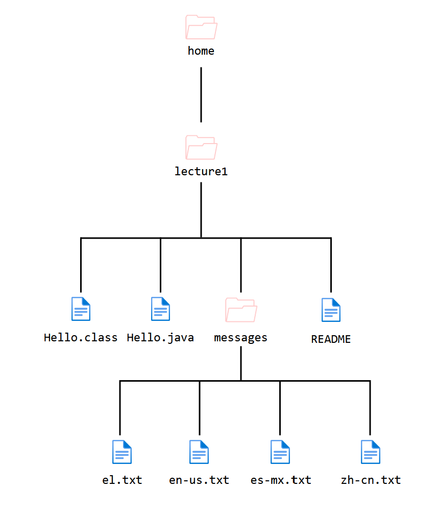

# Lab Report 1 - File System

Oct. 9, 2023

In this blog post, I will demonstrate 3 commonly used terminal commands: `cd`, `ls`, and `cat` through 3 different argument types.

First we will examine (1) using the command without arguments, (2) using the command with a path to a directory/folder as its argument, and (3) using the command with a path to a file as its argument.

---

### File System
<div align="center">
   
</div>

---

### 👉 `cd` changes the directory or moves us to another folder.

1. **<ins>No Argument</ins>**

   **Corrected:**
   I've realized that using `cd` while in the directory `/home` was probably the worst way to test what `cd` does without arguments. So, in the corrected version we will start in another directory `/home/lecture1`. In this case, we can more clearly see that what `cd` does without arguments is move us back to the home directory which is `/home` for me. This produces no errors and is a completely valid way to use the command.

   ```
   WORKING DIRECTORY: /home/lecture1
   
   1   [user@sahara ~/lecture1]$ cd
   2   [user@sahara ~]$ pwd
   3   /home
   ```

3. **<ins>Directory Path Argument</ins>**

   Here, I show a more useful application of the `cd` command. From `/home`, I navigate to the `lecture1` directory that is inside.

   Like with the previous case, `cd` did not output anything either and it does not need to for its purposes. In Line 2, I use `pwd` to confirm that the working directory had moved to `/home/lecture1`. Another place that reflects this change is the shell prompt itself. Specifically, in Line 1 the prompt only says `[user@sahara ~]$` but in Line 2 it says `[user@sahara ~/lecture1]$`. So, this is another way to see that the `cd` command was successful. **Corrected:** There were no errors as the `cd` command did exactly what we expected it to.

   ```
   WORKING DIRECTORY: /home
   
   1   [user@sahara ~]$ cd lecture1/
   2   [user@sahara ~/lecture1]$ pwd
   3   /home/lecture1
   ```


4. **<ins>File Path Argument</ins>**

   In Line 1, I execute the `cd` command with a path to a file as the argument, but I encounter an error in Line 2 that says `Hello.java` is not a directory. It makes sense that the command didn't work since `Hello.java` is a file. By definition, `cd` only works with directories.

   We can see that in Line 4, our working directory was not affected.

   ```
   WORKING DIRECTORY: /home/lecture1
   
   1   [user@sahara ~/lecture1]$ cd Hello.java
   2   bash: cd: Hello.java: Not a directory
   3   [user@sahara ~/lecture1]$ pwd
   4   /home/lecture1
   ```

---


### 👉 `ls` lists all the directories and files.

1. **<ins>No Argument</ins>**

   While in `/home/lecture1/messages/`, `ls` with no arguments is successful. In Line 2, the command outputs a whole list of the files within the working directory. Even though we did not use the command with an argument, it seems to default to the current working directory. **Corrected:** This is not an error; `ls` does exactly what it is supposed to do.

   ```
   WORKING DIRECTORY: /home/lecture1/messages
   
   1   [user@sahara ~/lecture1/messages]$ ls
   2   el.txt  en-us.txt  es-mx.txt  zh-cn.txt
   ```


2. **<ins>Directory Path Argument</ins>**

   In this example, I show two usages of `ls`—one successful and the other unsuccessful. In Lines 1-2, I try to list the files in `lecture1`, however, I receive an error because the path that it is trying to reference, `/home/lecture1/messages/lecture1/`, does not yet exist.

   For Lines 3-5, I use `ls ..` which means to list the files and directories in the directory that is a level above the current one. Since I referenced a valid path, the terminal outputted all the files and directories of `/home/lecture1/` as expected.

   ```
   WORKING DIRECTORY: /home/lecture1/messages
   
   1   [user@sahara ~/lecture1/messages]$ ls lecture1/
   2   ls: cannot access 'lecture1/': No such file or
       directory
   3   [user@sahara ~/lecture1/messages]$ ls ..
   4   Hello.class  messages
   5   Hello.java   README
   ```


3. **<ins>File Path Argument</ins>**

   For this case, I receive an error in Line 2 because the path that I am trying to reference, `/home/lecture1/messages/README` does not exist.
   
   ```
   WORKING DIRECTORY: /home/lecture1/messages
   
   1   [user@sahara ~/lecture1/messages]$ ls README
   2   ls: cannot access 'README': No such file 
       or directory
   ```

   But as an extra experiment, I try to reference a valid file path anyways. Moving up one directory, I use `ls` on a file. This time, we don't receive an error and the terminal outputs `README`. However, after repeating this with other files, it seems that the terminal just repeats whatever I put in the argument if it's a file. Truthfully, I'm not sure whether or not this is supposed to happen, but since there was no error, maybe this was valid! Questionable, but definitely valid.
   ```
   WORKING DIRECTORY: /home/lecture1/messages
   
   1   [user@sahara ~/lecture1/messages]$ cd ..
   2   [user@sahara ~/lecture1]$ ls README
   3   README
   4   [user@sahara ~/lecture1]$ ls Hello.class
   5   Hello.class
   6   [user@sahara ~/lecture1]$ ls Hello.java
   7   Hello.java
   8   [user@sahara ~/lecture1]$ ls messages/el.txt
   9   messages/el.txt
   ```

---

### 👉 `cat` outputs the contents of a file into the terminal.

1. **<ins>No Argument</ins>**

   The code below represents what happened to me. I noticed that after using `cat` with no argument, the shell prompt was not appearing like normal. I pressed enter to see if that would help. It did not.

   Afterwards, I decided to type something and press enter (Line 4). The terminal outputed what I had typed (Line 5). I tried this again with another word and the same thing happened.

   It seems that `cat` without arguments will wait for the user's input and print that instead of waiting on a file for input. I didn't know how to get the terminal back to normal so a quick Google search told me that [CTRL] + [D] would end the `cat` file for me. Even though I was confused at first, this outcome of using `cat` with no arguments appears intentional because there are no errors.
   ```
   WORKING DIRECTORY: /home
   
   1   [user@sahara ~]$ cat
   2
   3
   4   hi
   5   hi
   6
   7   
   8   what
   9   what
   ```


2. **<ins>Directory Path Argument</ins>**

   This time, I attempt to use `cat` on a directory. It fails (Line 2)! **Corrected:** This is an error because I am not able to use `cat` on directories! This makes sense since `cat` is supposed to only work on files. The computer doesn't know what to do if I pass it a directory.

   ```
   WORKING DIRECTORY: /home
   
   1   [user@sahara ~]$ cat /home/lecture1
   2   cat: /home/lecture1: Is a directory
   ```


3. **<ins>File Path Argument</ins>**

   Finally, here is an example of using `cat` with a valid file. The output is the printed contents of the `es-mx.txt` file. The file says "Hello World!" in Spanish. **Corrected:** There are no errors; this test was a success because the output in the terminal is what I expected.
   ```
   WORKING DIRECTORY: /home
   
   1   [user@sahara ~]$ cat /home/lecture1/messages/es-mx.txt
   2   ¡Hola Mundo!
   ```
