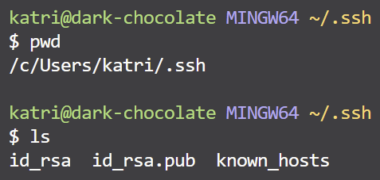

 # Lab Report 2 - Servers and SSH Keys

Oct. 22, 2023

Hello everyone! This time I will explain how a particular web server works and verify that my SSH keys on my local computer and UCSD server account work.

---

## 1️⃣ The Web Server

The code for my web server StringServer is [here](#my-server-code).

<center>
<table>
    <tr>
        <td>
            <div align="center">
                <p>This is the web server as it first starts and there is no added path.</p>
                
            </div>
             <div>
                <b>Methods Used:</b>
                    <ul>
                        <li><code>handleRequest()</code>: The URI</li>
                    </ul>
                <b>Relevant Fields:</b>
                    <ul>
                        <li><code>myString = ""</code></li>
                        <li><code>myNum = 1</code></li>
                    </ul>
            </div>
        </td>
    </tr>
    <tr>
        <td>
            <div align="center">
                <p>After adding one message.</p>
                
            </div>
            <div>
                <b>Methods Used:</b>
                    <ul>
                        <li><code>handleRequest()</code></li>
                    </ul>
                <b>Relevant Fields:</b>
                    <ul>
                        <li><code>myString = "1. I am working on this lab\n"</code></li>
                        <li><code>myNum = 1</code></li>
                    </ul>
            </div>
        </td>
    </tr>
    <tr>
        <td>
            <div align="center">
                <p>After adding two messages.</p>
                
            </div>
            <div>
                <b>Methods Used:</b>
                    <ul>
                        <li><code>handleRequest()</code></li>
                    </ul>
                <b>Relevant Fields:</b>
                    <ul>
                        <li><code>myString = "1. I am "MK</code></li>
                    </ul>
            </div>
        </td>
    </tr>
</table>
</center>

### Web Server Code for StringServer.java<a name="my-server-code"></a>

```java
/*
**  The template for this server is from https://github.com/ucsd-cse15l-f23/wavelet
**  and has been altered by me for the purposes of my Lab Report 2.
*/

import java.io.IOException;
import java.net.URI;

class Handler implements URLHandler {
    // Keep track of the editable string and how many
    // requests the site has gotten
    String myString = "";
    int myNum = 1;

    public String handleRequest(URI url) {
        // Home
        if (url.getPath().equals("/")) {
            return "Hello welcome to the StringServer!\n\n" +
            "How to use:\nAppend /add-message?s=<string> " +
            "to the URL to add a message!\n" +
            "(with your own message replacing <string>)\n\n" +
            "What to expect:\n" +
            "The website will show all your messages in an ordered list.";

        // User wants to add a message
        } else if (url.getPath().contains("/add-message")) {
            String[] parameters = url.getQuery().split("=");
            
            if (parameters[0].equals("s")) {
                // Concatenate myString with whatever the user put after the =
                // and increment myNum to increase the list number for the next add
                myString += String.format("%d. %s\n", myNum++, parameters[1]);
                return myString;
            }
            return "That didn't work oh no - double check your query!";
        } else {
            return "404 Not Found!";
        }
    }
}

class StringServer {
    public static void main(String[] args) throws IOException {
        if(args.length == 0){
            System.out.println("You forgot the port number, girl! :(");
            return;
        }

        int port = Integer.parseInt(args[0]);

        Server.start(port, new Handler());
    }
}

```

---

## 2️⃣ SSH

<center>
<table>
  <tr>
    <td>
      <b>Private Key:</b> The path to the private key on my personal computer <br>is <code>/c/Users/katri/.ssh/id_rsa</code>
    </td>
    <td>
      <div align="center">
        
      </div>
    </td>
  </tr>
  
  <tr>
    <td>
      <b>Public Key:</b> The path to the public key on my UCSD server account <br>is <code>/home/linux/ieng6/cs15lfa23/cs15lfa23hl/.ssh/id_rsa.pub</code>
    </td>
    <td>
      <div align="center">
        
      </div>
    </td>
  </tr>
  
  <tr>
    <td>
      <b>Logging in without password! Yay!</b>
    </td>
    <td>
      <div align="center">
        
      </div>
    </td>
  </tr>
</table>
</center>


---

## 3️⃣ New Things

Labs 2 and 3 have been big learning opportunities for me. It was my first time securely connecting to a remote server such as ieng6. Related to this, I learned that there is a way to connect to a remote server and skip the password login by using SSH keys. I thought it was very cool that the computer can generate a randomart image.
