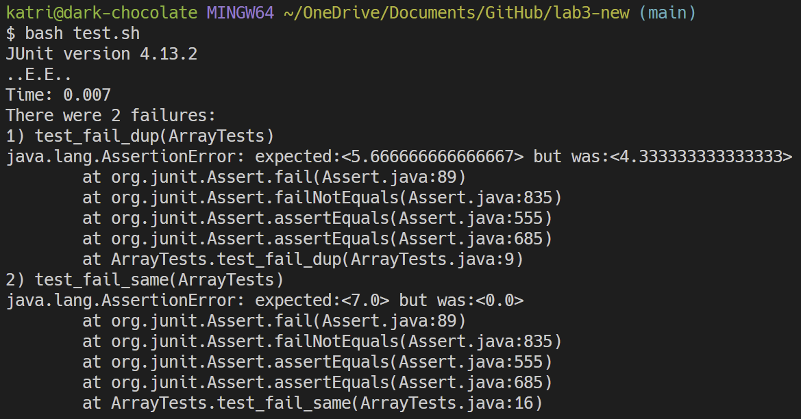
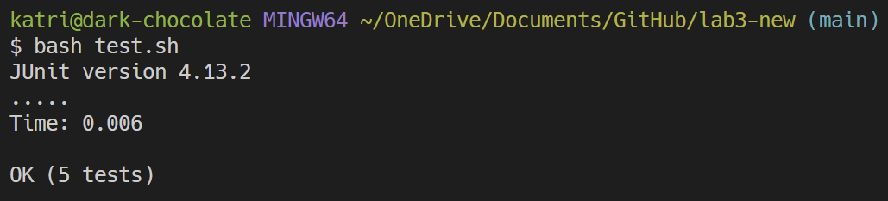

# Lab Report 3 - Bugs and Commands

Nov. 5, 2023

In this lab report, we will take a closer look at one of the bugs from Week 4's lab and examine its behavior under certain circumstances and its fixes. Additionally, I will also research additional options for the `less` command. 

---

## 1️⃣ Bugs

<!--Choose the bug from week 4-->
**The Buggy File and Method:** `ArrayExamples.java`, specifically the `averageWithoutLowest()` method.

Since there are many ways to interpret the behavior from `averageWithoutLowest()`, I should specifically define my standards so that we have a clearer understanding of what exactly constitutes a failed or successful test. After all, we can't decide what behavior is wrong if we haven't decided what's right.

For the purpose of the following tests, we will say that `averageWithoutLowest()` 
is succesful if the following conditions are met:
- When the array has 2 or more elements: The method will calculate the average of the values without the smallest number. <ins>However, if the smallest number appears more than once, only one instance of it will be removed.</ins>
- When the array has 0 or 1 elements: The method will return 0.

---
### The Inputs
<!--Failure inducing input (JUnit test and code block)-->
**Failure Inducing Inputs:**
- `{4,4,5,8}`
- `{7,7,7}`

```java
JUNIT TESTS:

@Test
public void test_fail_dup() {
    double[] input = {4, 4, 5, 8};
    double expected = (double)17/3;
    assertEquals(expected, ArrayExamples.averageWithoutLowest(input), 0.0001);
}

@Test
public void test_fail_same() {
    double[] input = {7,7,7};
    double expected = (double)(7 + 7)/2;
    assertEquals(expected, ArrayExamples.averageWithoutLowest(input), 0.0001);
}
```

<br>

<!--Non-failure input (JUnit and code block)-->
**Non-Failure inducing inputs:**
- `{9}`
- `{ }`
- `{1.1,2,3,4}`

```java
JUNIT TESTS:

@Test
public void test_nonfail_single() {
  double[] input = {9};
  double expected = 0;
  assertEquals(expected, ArrayExamples.averageWithoutLowest(input), 0.0001);
}

@Test
public void test_nonfail_empty() {
  double[] input = { };
  double expected = 0;
  assertEquals(expected, ArrayExamples.averageWithoutLowest(input), 0.0001);
}

@Test
public void test_nonfail3_unique() {
  double[] input = {1.1,2,3,4};
  double expected = (double)(2 + 3 + 4)/3;
  assertEquals(expected, ArrayExamples.averageWithoutLowest(input), 0.001);
}
```

---
### The Outputs

<!--output of both tests-->
The tests that failed were `test_fail_dup()` and `test_fail_same()`.

<br>

<div align="center">
  
</div>

---
### Fixing the Code
<!--The bug before/after fix, explain why the fix works-->

Looking at the tests that failed, a recurring pattern is that `averageWithoutLowest()` has trouble handling inputs where the lowest number appears more than once.

Specifically, in the test `test_fail_dup()` (input: `{4,4,5,8}`), what we expected was `5.667` as the result of `(4+5+8)/3`. But what the computer did was calculate `(5+8)/3` which resulted in the erroneous value of `4.333`.

In the case of `test_fail_same()` (input: `{7,7,7}`), we expect a returned value of `7` from the calculation `(7 + 7)/2`. However, what happened was that the method saw that `7` was the smallest value and therefore kept each instance of a `7` out of the calculations altogether. Thus, the wrong result returned was `0`.

Also, `averageWithoutLowest()` succeeded in the case where all numbers were unique such as in `test_nonfail3_unique()` (input: `{1.1,2,3,4}`). So it must be the repeating low numbers that are causing problems.

<br>

**Before Fixes:**
```java
static double averageWithoutLowest(double[] arr) {
  // 0 or 1 elements; works as expected
  if(arr.length < 2) { return 0.0; }

  // 2 or more elements; currently buggy
  double lowest = arr[0];
  for(double num: arr) {
    // Compares through array and finds lowest number
    if(num < lowest) { lowest = num; }
  }

  double sum = 0;
  for(double num: arr) {
    // I suspect the problem is here
    if(num != lowest) { sum += num; }
  }
  // and also here
  return sum / (arr.length - 1);
}
```

<br>

**After Fixes:**
```java
static double averageWithoutLowest(double[] arr) {
  // 0 or 1 elements; works as expected
  if(arr.length < 2) { return 0.0; }

  // 2 or more elements; fixed
  double lowest = arr[0];
  for(double num: arr) {
    // Compares through array and finds lowest number
    if(num < lowest) { lowest = num; }
  }

  // Fix: just add everything together
  // and get rid of the lowest number once at the end
  // when returning
  double sum = 0;
  for(double num: arr) {
    sum += num;
  }
  return (sum - lowest) / (arr.length - 1);
}
```

<br>

The reason why this fix works is because I removed the part of the code that checked if the current number in `arr` was equal to the lowest number. 

`if(num != lowest) { sum += num; }` is a problem because if you have multiple instances of the lowest number, it doesn't just remove one of them from the sum, it removes ALL of them. Which, as we said earlier was not the desired outcome.

So, in order to remove the lowest number just once, I replaced the numerator in the return statement to be `(sum - lowest)`. Thus preserving all of the other lowest numbers if they happend to show up more than once.


Now, all the tests pass!
<div align="center">
  
</div>

<br>
<br>

## 2️⃣ Researching Commands

<!--Researching `less`-->
In this section, I will examine more uses or options for the `less` command. 

One interesting thing I noticed about `less` is that we can add options even as we view the file. We don't have to add all the options all at once in the command line. 

<!-- 4 options or alternate uses 2 ex. each, cite source for each-->

---

### `--mouse`: scroll with the mouse
For the `--mouse` option, it allows us to view the file and scroll through the lines as if we were scrolling through a page. This can be useful if we don't like using the spacebar or the arrow keys and we simply want another way to navigate through the file viewer. It is worth noting that once the mouse input is enabled, I was not able to select text and copy it from the terminal. However, doing `--mouse` again turns the mouse input off.

<br>

**EXAMPLE 1**

  **Input**
  ```shell
  katri@dark-chocolate MINGW64 ~/OneDrive/Documents/GitHub/lab5/docsearch (main)
  $ less --mouse technical/government/Alcohol_Problems/Session2-PDF.txt
  ```

  **Output**
  ```
  Session 2.
  Identifying ED Patients with Alcohol Problems

  Robert Woolard, MD
  Many patients in the emergency department (ED) have alcohol
  problems, and they can be identified.1 Research on techniques used
  to identify these patients has been conducted, but several areas of
  interest should be addressed by further research. We need to
  further examine and refine alcohol-screening questionnaires in the
  ED. We need to determine the sequence and combination of questions
  and tests that constitute the best screening process. We need to

  .
  .
  .

  (etc)
  ```

  The file contents and what the user sees don't change, but the user is now able to scroll through the `less` viewer with mouse input.


<video>
    <source src="https://github.com/klaguedan/cse15l-lab-reports/assets/146864422/150798ec-b5fa-449a-96a3-96a458d7a4e0" type="vide/mp4">
</video>


<br>
<br>

**EXAMPLE 2**

  In this example, we will show what happens with `mouse` when we capitalize all the letters. So now, our option is `--MOUSE`. What happens is that we are still able to scroll through the viewer, just now the directions are reversed. The page will move down if the user scrolls in the down direction. We can actually run this command while in the viewer; we don't have to type out the `less` command and file all over again.
  So if the user has a preference for which way the viewer scrolls, this option would be useful.

  **File Viewer Input**
  ```shell
  --MOUSE
  ```

  **Output**
  (Nothing new is visible, file wise. However, for the user, the scroll direction is now reversed).


<video>
    <source src="https://github.com/klaguedan/cse15l-lab-reports/assets/146864422/41ef6f61-6351-4e89-b551-6b23970d4126" type="vide/mp4">
</video>

<br>

---

### `&<pattern>`: show only the lines that match the pattern (Case Sensitive)

This is an option that only works once the viewer is open.

<br>

**EXAMPLE 1**

  **Command Line Input**
  ```shell
  katri@dark-chocolate MINGW64 ~/OneDrive/Documents/GitHub/lab5/docsearch (main)
  $ less technical/biomed/1468-6708-3-4.txt
  ```

  **File Viewer Input**
  ```shell
  &/treatment
  ```
  <br>

  **Output**
  ```
  unrelated to trial procedure and treatments. Missing data
            randomized 205 to treatment, however, only 178 patients
            treatment period. 'The remaining patients were excluded
            study to compare the treatment effect of niacin and
            total 108 patients randomized to treatment, 12 withdrew
            placebo-controlled trial to assess treatment effect of
            hydrochlorothiazide (HCTZ) plus placebo for the treatment
            randomized into three treatment groups. 'A total of 235
          calculations within each treatment group along with a
          treatment groups.
          withdrawal according to their treatment group. The reasons
          treatment group separately. The bias seen in the medical
          true for the latter: patients responding to treatment tend
            would be the treatment effect without dropouts? and (ii)
            What would be the treatment effect in the presence of
            merely from the study assigned treatment with data still
            treatment (lovastatin or placebo), were contacted
            discontinuing the study treatment, type (a) dropout
            (meaning working against an effective treatment group).
            treatment groups. The underlying principle is that when
            the treatment groups, the relative comparison of the

  ```

  In this example, I receive every line in `1468-6708-3-4.txt` that has the word "treatment."

<br>
<br>

**EXAMPLE 2**

  **Command Line Input**
  ```shell
  katri@dark-chocolate MINGW64 ~/OneDrive/Documents/GitHub/lab5/docsearch (main)
  $ less technical/biomed/1471-2105-3-24.txt
  ```

  **File Viewer Input**
  ```shell
  &/mutation
  ```
  <br>

  **Output**
  ```
  For many years, scientists believed that point mutations
        mutations occur in functionally important regions of the
        collect disease associated mutational data in databases and
        suggests that many of the mutations represented in those
        collected are mutations annotated with their observed
        mutations. Algorithms are needed for automatically
        unobserved mutations are discovered. Every human has
        mutations or groups of mutations that are attributable to a
        consequences of a mutation [ 13 ] . These reports predict
        to be a useful component in determining whether a mutation
        is deleterious [ 13 14 ] . Disease causing mutations are
        The relationship between disease-associated mutation
        disease-associated mutations tend to occur in highly
        mutations often occur in the highly conserved
        analyze Osteogenesis imperfecta associated COL1A1 mutations
        and disease-associated P53 mutations (Mooney and Klein,
        disease-associated mutations are conserved in seven model
        To determine the degree to which mutation positions
        with disease-associated mutations are conserved more than
        most conserved mutations are likely to be the causative
        mutations.
  ```

This option acts like the command `grep` in a way; it shows only the lines in the file that match a pattern. This can be useful if we want to check if a particular topic shows up. However, this feature can be more useful when combined with other ones such as the next one.

---

### `-N`: show line numbers while viewing.

<br>

**EXAMPLE 1**

  **Command-Line Input**
  ```shell
  katri@dark-chocolate MINGW64 ~/OneDrive/Documents/GitHub/lab5/docsearch (main)
  $ less -N technical/plos/journal.pbio.0020042.txt
  ```


  <br>

  **Output**
  ```
  1
  2
  3
  4
  5
  6         During the last few years, we have seen enormous strides in our abilities to sequence
  7         genomes, and the information that has poured out of these sequences is quite astonishing.
  8         With more than 150 complete genome sequences now available and many laboratories rushing
  9         into microarray analysis, proteomic initiatives, and even systems biology, it seems an
  10        appropriate time to consider not just the opportunities those sequences present, but also
  11        their shortcomings. By far the most serious problem is the quality and degree of
  12        completeness of the annotation of those genomes. Most troublesome are the large numbers of
  13        open reading frames that have been identified by computer programs, but remain labeled as a
  14        “conserved hypothetical protein” when they occur in more than one genome or simply a
  15        “hypothetical protein” when they appear unique to the genome in question. Between them,
  16        these two categories of annotated open reading frames often represent more than half of the
  17        potential protein-coding regions of a genome.
  18        These annotations highlight just one portion of our ignorance about the information
  19        content of genomes and our lack of fundamental knowledge about the function of so many of
  20        the building blocks of cells. Unless we rectify this situation, it is likely to undermine
  21        many of the other “-omic” efforts currently underway. Here I advocate a rather

  .
  .
  .

  (etc)
  ```

In this example, all the lines of text in `journal.pbio.0020042.txt` are numbered. This feature can be helpful for keeping place while reading a file or to see how many lines a file has as you read through it.

<br>
<br>

**EXAMPLE 2**

  **Command-Line Input**
  ```shell
  katri@dark-chocolate MINGW64 ~/OneDrive/Documents/GitHub/lab5/docsearch (main)
  $ less -N technical/government/Media/Anthem_Payout.txt
  ```


  **File Viewer Input**
  ```shell
  &/money
  ```

  <br>

  **Output**
  ```
  19  programs. That's because they suddenly have more money than the
  22  in a nursing home, recipients may need to spend their money fast -
  25  "You would think money out of the blue would be a good thing,"
  71  because they won't understand how to handle this (money)," said
  99  spend the money on. Kentucky advocates and Medicaid officials
  105 The main requirement is, you must get value for your money.
  107 official could treat the money as unspent, which could affect your
  110 restriction on what you can buy with your money . . .as long as you
  111 spend the money," said Christopher Holly, a paralegal with Indian
  ```

Here, I use `-N` in combination with `&/money` so that it shows every line containing "money" and shows the line number from the original file! This is useful for keeping note of where specifically a particular topic showed up in a file. 

---
### `:n`: when giving multiple files as arguments, skips to the next file.
### `:p`: when giving multiple files as arugments, skips to the previous file.

<br>

These options work in tandem with one another and are useful for flipping back and forth between files that you want to read with `less`, so I have grouped them together as the last "option."

`:n` and `:p` are only applicable if you have used multiple files as arguments to `less`. These are also options that work only once you're in the file viewer.

**Command Line Input**
```shell
katri@dark-chocolate MINGW64 ~/OneDrive/Documents/GitHub/lab5/docsearch/technical/government/Alcohol_Problems (main)
$ less *.txt
```

**Output**
```
Discussion of
Draft Recommendations

Daniel Hungerford opened the final session of the conference by
outlining the group's ultimate task-to create research
recommendations from conference deliberations. Before the
conference, he and Daniel Pollock drafted recommendations for the
steering committee to consider. During the conference, the steering
committee modified those recommendations, and they were distributed
to attendees for general discussion.
Hungerford stated that the goal of the conference was not to
achieve unanimity regarding the recommendations, but to have
significant and general agreement. He indicated the process would
be to discuss the recommendations one by one, identifying any gaps
or omissions and offering general comments. He emphasized that the
sequence of the recommendations did not imply a priority order.
Because the published recommendations will include supporting text,
DraftRecom-PDF.txt (file 1 of 4)
```

Notice that in the last line of the output it shows, in additional to the file name, how many other files there are that have been loaded and which number "page" or file we are currently on.

<br>

**EXAMPLE 1**

  **File Viewer Input**
  ```shell
  :n
  ```

  **Output**
  ```
  Session 2.
  Identifying ED Patients with Alcohol Problems

  Robert Woolard, MD
  Many patients in the emergency department (ED) have alcohol
  problems, and they can be identified.1 Research on techniques used
  to identify these patients has been conducted, but several areas of
  interest should be addressed by further research. We need to
  further examine and refine alcohol-screening questionnaires in the
  ED. We need to determine the sequence and combination of questions
  and tests that constitute the best screening process. We need to
  study barriers to screening, identify factors that promote
  screening implementation, and demonstrate the impact of a screening
  program in the ED. The final aim of screening must be improved
  outcomes through referral and counseling. Identification is only
  the first step in a process of care.
  Alcohol problems defined
  Session2-PDF.txt (file 2 of 4)
  ```
  
  In this example, I start from the first file `DraftRecom-PDF.txt` and tell `less` to show the next file which is `Session2-PDF.txt`.

<br>
<br>

**EXAMPLE 2**

  In this example, we will assum that we have reached `Session4-PDF.txt (file 4 of 4)` and now we want to go backwards.

  **File Viewer Input**
  ```shell
  :p
  ```

  **Output**
  ```
  Session 3.
  Intervening with Alcohol Problems
  in Emergency Settings

  Carlo C. DiClemente, PhD* Carl Soderstrom, MD
  Excessive alcohol consumption plays an important role in many of
  the medical conditions, accidents, and injuries that cause visits
  to emergency departments and trauma centers. Many studies have
  documented the presence of alcohol among patients admitted to
  emergency depart-ment1-5 and trauma center6,7 settings. Other
  studies have demonstrated that even blood alcohol concentration
  (BAC) determinations under-estimate the extent of alcohol problems
  among the patients who are triaged and treated in emergency
  settings.4,7 The prevalence of this co-factor to the emergency
  admission, and the fact that alcohol is a risk factor both for the
  first visit and for a return visit to the emergency setting, have
  occasioned a call for an effective method of intervening with
  Session3-PDF.txt (file 3 of 4)
  ```

  In this example, we tell `less` to show the previous file. Both commands, `:n` and `:p` are helpful when we want to use `less` with many files in one sitting and want to have quick viewing access to each one. The user can go back and forth at will.

