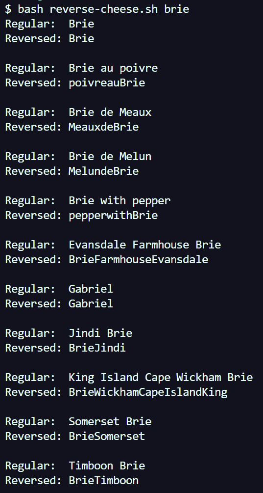

# Lab Report 5 - Putting it All Together

Dec. 3, 2022

In this lab report, Part 1 will go over an imaginary debugging scenario and Part 2 will be a reflection on what I've learned this second half of the quarter.

<br>

## 1️⃣🧀 Debugging Scenario

First, a quick summary of what the student is trying to achieve. The student's objective will be to run the bash script `reverse-cheese.sh` with a string as an argument. The bash script will search for cheeses in `cheese.txt` that match the string, then send all matches to `ReverseCheese.java` to reverse all the characters in that cheese. The results should show a `Regular` and `Reversed` cheese.

<br>

### File Structure:

```
root/
  ├ reverse-cheese.sh
  ├ cheese.txt
  └ ReverseCheese.java
```

<br>

### `cheese.txt` before fixes:

```
Abbaye de Belloc
Abbaye de Citeaux
Abbaye du Mont des Cats
.
.
.
(it's just 653 lines of cheese)
```

<br>

### `reverse-cheese.sh` before fixes:

```bash
# Save all cheeses that contain the user's argument
# into a file called "reverse-cheese.txt"
grep -i "$1" cheese.txt > to-reverse.txt

# Compile Java file
javac ReverseCheese.java
INPUT=to-reverse.txt

# the "read" command turns each line of to-reverse.txt
# into a variable called LINE.
while read LINE
do
  # Treat the current LINE as the arg[0] for ReverseCheese
  java ReverseCheese "$LINE"
done < "$INPUT" # Take in reverse-cheese.txt as input.
```

<br>

### `ReverseCheese.java` before fixes:

```java
public class ReverseCheese {
  // Read the array back
  public static String toString(String[] arr) {
    String contents = "";
    for (int i=0; i < arr.length; i++) {
      contents += arr[i];
    }

    return contents;
  }

  // Reverse the characters in the string
  public static String reverse(String userInput) {
    String[] toReverse = userInput.split(" ");

    for (int i=0; i < toReverse.length/2; i++) {
      String curr = toReverse[i];
      String temp = toReverse[toReverse.length - i - 1];

      toReverse[i] = temp;
      toReverse[toReverse.length - i - 1] = curr;
    }

    return toString(toReverse);
  }

  public static void main(String[] args) {
    String userInput = args[0];
    String inputReversed = reverse(userInput);
    
    System.out.println("Regular:  " + userInput);
    System.out.println("Reversed: " + inputReversed);
    System.out.println();

  }
}
```


---

### __<ins>Original Post</ins>__

**STUDENT:** Hello! Whenever I run `reverse-cheese.sh` with a valid string argument, the correct cheeses are shown but they do not seem to be reversing correctly. I'm not sure which part of the code (script, java file, text file) is responsible for this.

<div align="center">
    
</div>

<br>

**TA:** Indeed, the `Regular:` output all seems right but the strings aren't reversing like how we'd like them. Which file and method are responsible for reversing the strings? I would recommend taking a closer look there and using `jdb` to notice any suspicious variable values. You may find some useful clues there. Best of luck!

<br>

---

### __<ins>Debugging</ins>__

The file containing the method that does the actual reversing of the cheeses is `ReverseCheese.java`.

The method in this file that reverses is `reverse()`. The student now proceeds to use `jdb` to inspect this part of the code.

```bash
$ javac -g ReverseCheese.java
$ jdb ReverseCheese "Vermont Cheddar Cheese"

Initializing jdb ...
> stop at ReverseCheese:29 # Stops before the string is reversed
Deferring breakpoint ReverseCheese:29.
It will be set after the class is loaded.

> run
run ReverseCheese "Vermont Cheddar Cheese"
Set uncaught java.lang.Throwable
Set deferred uncaught java.lang.Throwable
>
VM Started: Set deferred breakpoint ReverseCheese:29

Breakpoint hit: "thread=main", ReverseCheese.main(), line=29 bci=4
29        String inputReversed = reverse(userInput);
```

<br>

Taking a closer look at the value of all variables when `reverse()` is called. Of particular note is the variable `toReverse[]` because it is a variable within the `reverse()` method that contains the elements of the input string that will be reversed.

```bash
main[1] locals
Method arguments:
args = instance of java.lang.String[1] (id=525)
Local variables:
userInput = "Vermont Cheddar Cheese"


# Execute the next line which is splitting the string
# into elements to be reversed
main[1] step
>
Step completed: "thread=main", ReverseCheese.reverse(), line=14 bci=0
14        String[] toReverse = userInput.split(" ");


# Variable still not assigned, but one more step should do
# the trick
main[1] locals
Method arguments:
userInput = "Vermont Cheddar Cheese"
Local variables:


# Calls the reverse() method on the cheese
main[1] step
>
Step completed: "thread=main", ReverseCheese.reverse(), line=16 bci=7
16        for (int i=0; i < toReverse.length/2; i++) {

# "toReverse" exists now but locals cannot print its contents
main[1] locals
Method arguments:
userInput = "Vermont Cheddar Cheese"
Local variables:
toReverse = instance of java.lang.String[3] (id=528)

# View contents of "toReverse." This array does not
# contain the right values!
main[1] dump toReverse
 toReverse = {
"Vermont", "Cheddar", "Cheese"
}
main[1] exit

Regular:  Vermont Cheddar Cheese
Reversed: CheeseCheddarVermont
```

---


### __<ins>The Fix</ins>__

We expect the values in `toReverse[]` to be individual letters, not entire words. Thus, there must be something wrong with how the array is assigned its elements.

In Line 14 of  `ReverseCheese.java`, the `split()` method is used on `userInput` to help assign elements to `toReverse[]`.

```java
String[] toReverse = userInput.split(" ");
```

The space makes it so that the string is split where there is a space character (so separating words). However, we want the individual letters to be the elements so there cannot be a space. This is the bug.

To fix it, simply change the argument in `split()` to quotes with nothing in between:

```java
String[] toReverse = userInput.split("");
```

Now, the string will be split across every character.

<br>

Now when we do `jdb` again and check the same variable, the elements of `toReverse[]` will be all the characters in the input string.

```bash
(same commands and breakpoint as before)
.
.
.
main[1] step
>
Step completed: "thread=main", ReverseCheese.reverse(), line=16 bci=7
16        for (int i=0; i < toReverse.length/2; i++) {

# toReverse[] now has the correct elements. Each character is separated
main[1] locals
Method arguments:
userInput = "Vermont Cheddar Cheese"
Local variables:
toReverse = instance of java.lang.String[22] (id=535)
main[1] dump toReverse
 toReverse = {
"V", "e", "r", "m", "o", "n", "t", " ", "C", "h", "e", "d", "d", "a", "r", " ", "C", "h", "e", "e", "s", "e"
}

# Output is what we expect
main[1] exit
Regular:  Vermont Cheddar Cheese
Reversed: eseehC raddehC tnomreV
```

<br>

Rerunning the student's command from the beginning, now every cheese result is reversed correctly:

```bash
$ bash reverse-cheese.sh brie
Regular:  Brie
Reversed: eirB

Regular:  Brie au poivre
Reversed: erviop ua eirB

Regular:  Brie de Meaux
Reversed: xuaeM ed eirB

Regular:  Brie de Melun
Reversed: nuleM ed eirB

Regular:  Brie with pepper
Reversed: reppep htiw eirB

Regular:  Evansdale Farmhouse Brie
Reversed: eirB esuohmraF eladsnavE

Regular:  Gabriel
Reversed: leirbaG

Regular:  Jindi Brie
Reversed: eirB idniJ

Regular:  King Island Cape Wickham Brie
Reversed: eirB mahkciW epaC dnalsI gniK

Regular:  Somerset Brie
Reversed: eirB tesremoS

Regular:  Timboon Brie
Reversed: eirB noobmiT
```


## 2️⃣ Reflection

Something I didn't know before was vim! I didn't know that there existed a tool that allowed us to edit files directly from the terminal. Although finicky at times, I see the value in vim when working on remote servers and in general, there were many helpful commands I learned that made editing a file or a script faster. Of course, it doesn't replace the convenience of using a normal text editor or IDE, but vim is helpful as a backup plan. Related, I think it was cool to see that vim had a built in vimtutor module to learn and practice using vim.